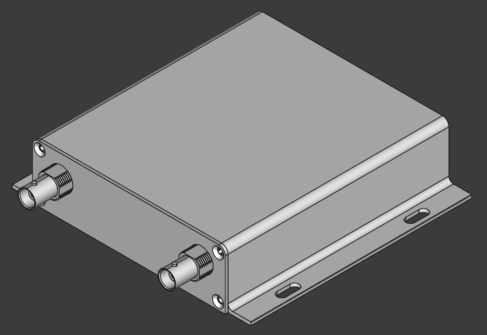
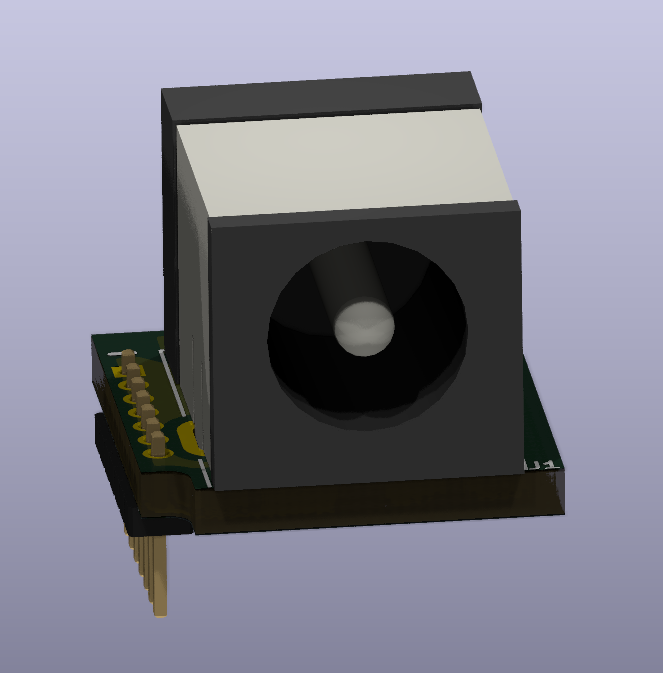
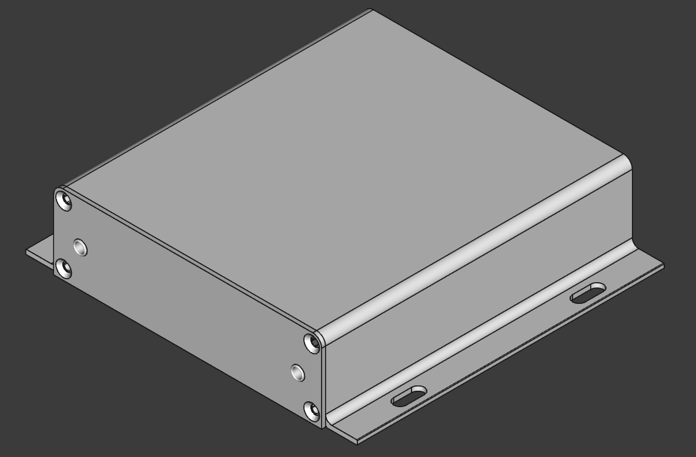
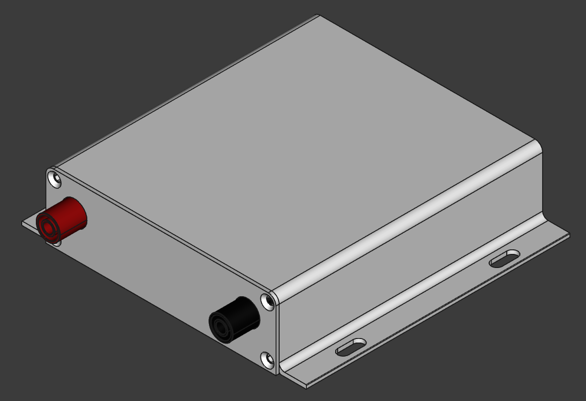

# ModuBits
This is a versatile set of prototyping boards and modules designed to fit chassis measuring 100mm wide and 120mm deep. Each module allows for easy integration of various connectors and components, enabling efficient prototyping and experimentation in electronics projects. 

ECAD tool: KiCad 9.99 (nightly)

MCAD tool: FreeCAD 1.0.2

  

  

Compatible chassis:
- [K93-10436-H7-L120](https://jlcmc.com/product/b/U01/BR9212/aluminum-box-(jlc)---104*36*120mm,-split,-monolithic)
- [K97-10473-H7-L120](https://jlcmc.com/product/b/U01/BR9241/aluminum-box-(jlc)---104*73*120mm,-split,-monolithic)
- [K96-10463-H7-L120](https://jlcmc.com/product/b/U01/BR9259/aluminum-box-(jlc)---104*63*120mm,-split,-monolithic)
- [K127-13031-H7-L120](https://jlcmc.com/product/b/U01/BR10337/aluminum-box-(jlc)---130*31*120mm,-monolithic,-with-handles)

BNC module:

  
  
  

Note that BNC connector parts of this type may share the same footprint but differ in the height of the connector in order to vendor lock their customers. Check for the height of your part, which is 6.25mm in this example.

  

BNC reference design:
  

    
  

Chassis K127-13031-H7-L120:
  

    
  

Chassis K93-10436-H7-L120:
  

    
  

Chassis K97-10473-H7-L120:
  

    
  

Chassis K96-10463-H7-L120:
  

    
  

Barrel Jack module (PJ-063AH):

  
  
  

Barrel jack reference design:
  

    
  

Chassis K127-13031-H7-L120:
  

    
  

Chassis K93-10436-H7-L120:
  

    
  

Chassis K97-10473-H7-L120:
  

    
  

Chassis K96-10463-H7-L120:
  

    
  

3.5mm Audio Jack module (SJ3-35083D-TR):

  
  
  

Audio jack reference design:
  

    
  

Chassis K127-13031-H7-L120:
  

    
  

Chassis K93-10436-H7-L120:
  

    
  

Chassis K97-10473-H7-L120:
  

    
  

Chassis K96-10463-H7-L120:
  

    
  

4mm Banana Jack module (Banana_Cliff_FCR7350B_S16N-PC_Horizontal):

  
  
  

4mm Banana jack reference design:
  

    
  

Chassis K127-13031-H7-L120:
  

    
  

Chassis K93-10436-H7-L120:
  

    
  

Chassis K97-10473-H7-L120:
  

    
  

Chassis K96-10463-H7-L120:
  

    
  

Connectorless PMMA plastic optic fiber receiver (IF-D91B):

  
  
  
  

Connectorless PMMA plastic optic fiber receiver reference design:
  

    
  

Chassis K127-13031-H7-L120:
  

    
  

Chassis K93-10436-H7-L120:
  

    
  

Chassis K97-10473-H7-L120:
  

    
  

Chassis K96-10463-H7-L120:
  

    
  

Connectorless PMMA plastic optic fiber transmitter (IF-E96E):

  
  
  

Connectorless PMMA plastic optic fiber transmitter reference design:
  

    
  

Chassis K127-13031-H7-L120:
  

    
  

Chassis K93-10436-H7-L120:
  

    
  

Chassis K97-10473-H7-L120:
  

    
  

Chassis K96-10463-H7-L120:
  

    
  

Right-angle tactile switch (PTS645V):

  
  
  

Right-angle tactile switch reference design:
  

    
  

Chassis K127-13031-H7-L120:
  

    
  

Chassis K93-10436-H7-L120:
  

    
  

Chassis K97-10473-H7-L120:
  

    
  

Chassis K96-10463-H7-L120:
  

    
  

The indices of the modules used to determine the position of the modules on the protoboard:

  
  
  
  
  
  
  

The white bars at the bottom edge of the protoboard mark the decadal numbers and the index has a range of 0..72.

  

The following table lists the reference coordinates for the frontpanel hole if the module is sitting on the reference point (index == 0). The coordinates of the respective frontpanel hole can be calculated by adding (if the protoboard is component side up) or subtracting (if the protoboard is component side down) 1.27mm times index (of the module), since the modules are on a 50mil(1.27mm) grid.

I may write a FreeCAD script at some point to automate the generation of the frontpanel MCAD files.

| Chassis                         | Cutout Coordinates [X/Y] mm 4mm Banana D=11.5mm | Cutout Coordinates [X/Y] mm BNC D=13mm | Cutout Coordinates [X/Y] mm IF-D91B D=6.3mm | Cutout Coordinates [X/Y] mm IF-E96E D=6.3mm | Cutout Coordinates [X/Y] mm PJ-063AH D=7mm | Cutout Coordinates [X/Y] mm PTS645V D=3.6mm | Cutout Coordinates [X/Y] mm SJ3-35083D-TR D=5.2mm |
|---------------------------------|-------------------------------------------------|----------------------------------------|---------------------------------------------|---------------------------------------------|--------------------------------------------|---------------------------------------------|---------------------------------------------------|
| K93-10436-H7-L120, level1, up   | 12.63+index*1.27 / 19.92                        | 15.18+index*1.27 / 20.72               | 11.36+index*1.27 / 20.6                     | 11.36+index*1.27 / 20.6                     | 12.63+index*1.27 / 18.62                   | 11.38+index*1.27 / 17.12                    | 10.09+index*1.27 / 16.15                          |
| K127-13031-H7-L120, level1, up  | 13.03+index*1.27 / 18.33                        | 15.55+index*1.27 / 19.14               | 11.76+index*1.27 / 19.02                    | 11.76+index*1.27 / 19.02                    | 13.03+index*1.27 / 17.02                   | 11.79+index*1.27 / 15.53                    | 10.49+index*1.27 / 14.56                          |
| K97-10473-H7-L120, level1, up   | 12.63+index*1.27 / 19.92                        | 15.17+index*1.27 / 20.70               | 11.36+index*1.27 / 20.64                    | 11.36+index*1.27 / 20.64                    | 12.63+index*1.27 / 18.62                   | 11.38+index*1.27 / 17.12                    | 10.09+index*1.27 / 16.15                          |
| K97-10473-H7-L120, level4, down | 91.37-index*1.27 / 53.06                        | 88.83-index*1.27 / 52.25               | 92.64-index*1.27 / 52.41                    | 92.64-index*1.27 / 52.41                    | 91.37-index*1.27 / 54.36                   | 92.62-index*1.27 / 55.86                    | 93.91-index*1.27 / 56.83                          |
| K96-10463-H7-L120, level1, up   | 12.63+index*1.27 / 19.93                        | 15.17+index*1.27 / 20.74               | 11.36+index*1.27 / 20.58                    | 11.36+index*1.27 / 20.58                    | 12.63+index*1.27 / 18.63                   | 11.38+index*1.27 / 17.14                    | 10.09+index*1.27 / 16.16                          |
| K96-10463-H7-L120, level4, down | 91.37-index*1.27 / 43.07                        | 88.83-index*1.27 / 42.26               | 92.64-index*1.27 / 42.35                    | 92.64-index*1.27 / 42.35                    | 91.37-index*1.27 / 44.38                   | 92.62-index*1.27 / 45.88                    | 93.91-index*1.27 / 46.84                          |
