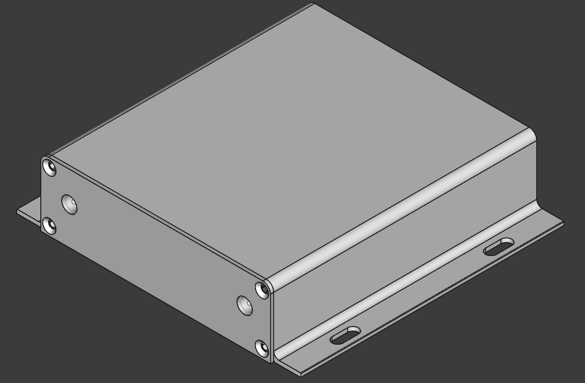
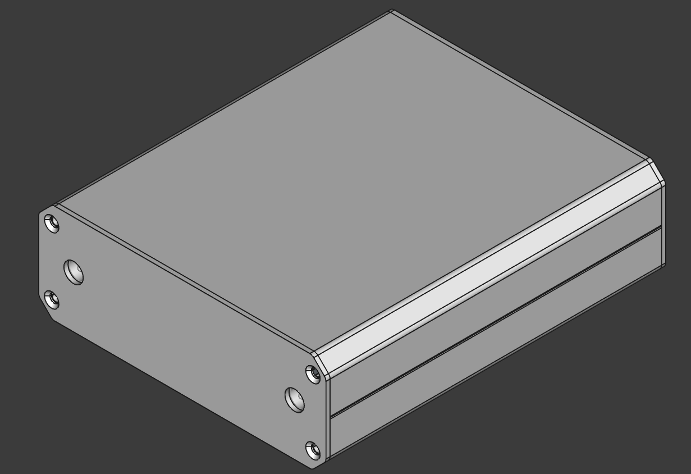
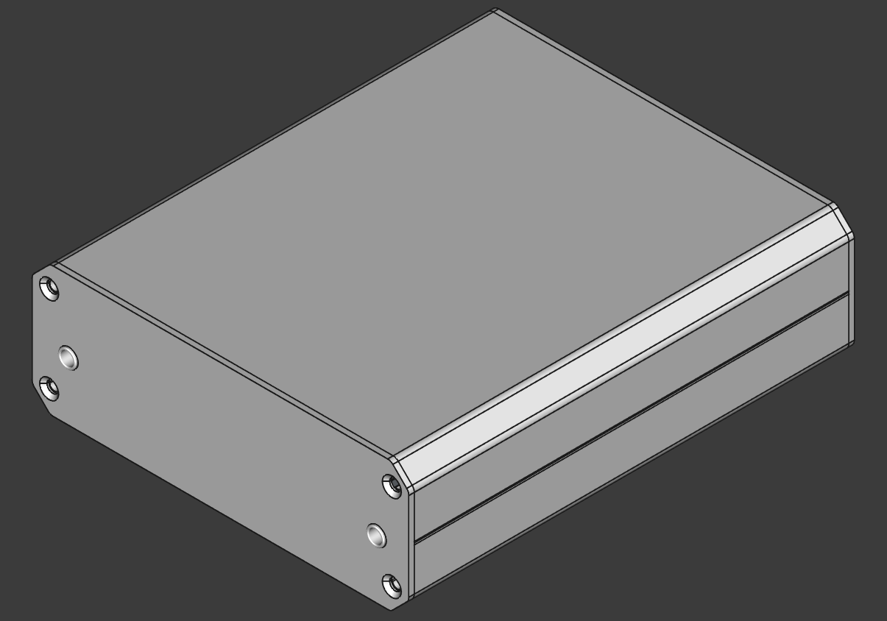

# ModuBits
This is a versatile set of prototyping boards and modules designed to fit chassis measuring 100mm wide and 120mm deep. Each module allows for easy integration of various connectors and components, enabling efficient prototyping and experimentation in electronics projects.

ECAD tool: KiCad 9.99 (nightly)

MCAD tool: FreeCAD 1.0.2

  

  

Compatible chassis:
- [K93-10436-H7-L120](https://jlcmc.com/product/b/U01/BR9212/aluminum-box-(jlc)---104*36*120mm,-split,-monolithic)
- [K97-10473-H7-L120](https://jlcmc.com/product/b/U01/BR9241/aluminum-box-(jlc)---104*73*120mm,-split,-monolithic)
- [K96-10463-H7-L120](https://jlcmc.com/product/b/U01/BR9259/aluminum-box-(jlc)---104*63*120mm,-split,-monolithic)
- [K127-13031-H7-L120](https://jlcmc.com/product/b/U01/BR10337/aluminum-box-(jlc)---130*31*120mm,-monolithic,-with-handles)

BNC module:

  
  
  

Note that BNC connector parts of this type may share the same footprint but differ in the height of the connector in order to vendor lock their customers. Check for the height of your part, which is 6.25mm in this example.

  

BNC reference designs:

Chassis K127-13031-H7-L120:
  

    
  

Chassis K93-10436-H7-L120:
  

    
  

Chassis K97-10473-H7-L120:
  

    
  

Barrel Jack module (PJ-063AH):

  
  
  

Barrel jack reference designs:

Chassis K127-13031-H7-L120:
  

    
  

Chassis K93-10436-H7-L120:
  

    
  

Chassis K97-10473-H7-L120:
  

    
  

3.5mm Audio Jack module (SJ3-35083D-TR):

  
  
  

Audio jack reference designs:

Chassis K127-13031-H7-L120:
  

    
  

Chassis K93-10436-H7-L120:
  

    
  

Chassis K97-10473-H7-L120:
  

    
  

4mm Banana Jack module (Banana_Cliff_FCR7350B_S16N-PC_Horizontal):

  
  
  

4mm Banana jack reference designs:

Chassis K127-13031-H7-L120:
  

    
  

Chassis K93-10436-H7-L120:
  

    
  

Chassis K97-10473-H7-L120:
  

    
  

Connectorless PMMA plastic optic fiber receiver (IF-D91B):

  
  
  

Connectorless PMMA plastic optic fiber receiver reference designs:

Chassis K127-13031-H7-L120:
  

    
  

Chassis K93-10436-H7-L120:
  

    
  

Chassis K97-10473-H7-L120:
  

    
  

Connectorless PMMA plastic optic fiber transmitter (IF-E96E):

  
  
  

Connectorless PMMA plastic optic fiber transmitter reference designs:

Chassis K127-13031-H7-L120:
  

    
  

Chassis K93-10436-H7-L120:
  

    
  

Chassis K97-10473-H7-L120:
  

    
  

Right-angle tactile switch (PTS645V):

  
  
  

Right-angle tactile switch reference designs:

Chassis K127-13031-H7-L120:
  

    
  

Chassis K93-10436-H7-L120:
  

    
  

Chassis K97-10473-H7-L120:
  

    
  

